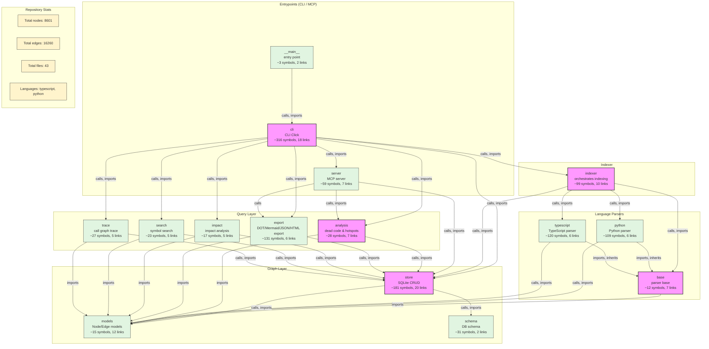

# Eizō (映像) — Codebase Knowledge Graph CLI

映像 — "imagem/reflexão". Reflete a estrutura do código como um grafo de conhecimento.

## Visão Geral

**Eizō** é uma CLI Python que parseia codebases com **Tree-sitter**, constrói um **knowledge graph** de código em **SQLite**, e expõe consultas via **CLI** e **servidor MCP** (Model Context Protocol) para agentes LLM.

### Para que serve?

- **Desenvolvedores**: entenda a arquitetura de qualquer repositório sem ler arquivo por arquivo
- **Agentes LLM**: dê contexto estrutural para Claude Code, Cline, Roo Code, Continue e outros via MCP
- **Onboarding**: novos membros do time exploram o grafo em vez de grep cego
- **Análise de impacto**: antes de mudar um símbolo, veja toda a cadeia de dependências

## Stack

| Camada | Tecnologia |
|--------|-----------|
| CLI | Python 3.10+ / Click / Rich |
| Parsing | Tree-sitter (Python + TypeScript/JavaScript) |
| Grafo | SQLite (WAL mode, FTS5) |
| MCP | `mcp` Python SDK |
| Testes | pytest + pytest-cov |
| Lint | Ruff + mypy |

## Instalação

```bash
# Clone o repositório
git clone https://github.com/ninja-apps/eizo.git
cd eizo

# Instale com dependências de desenvolvimento
make install
# ou: pip install -e ".[dev]"
```

## Uso

### Indexar um repositório

```bash
# Indexa o diretório atual (incremental — pula arquivos inalterados)
eizo init

# Indexa um diretório específico
eizo init /caminho/do/projeto

# Ou via --repo/-C
eizo init --repo /caminho/do/projeto

# Lista arquivos que seriam indexados sem persistir
eizo init --dry-run
eizo init --dry-run --output-format json

# Força reindexação de todos os arquivos
eizo init --force

# Reconstrói o grafo do zero (limpa DB + reindexa tudo)
eizo init --rebuild
```

A indexação é **incremental**: arquivos cujo conteúdo (hash SHA-256) não mudou
desde a última indexação são pulados automaticamente. Use `--force` ou `--rebuild`
para forçar reindexação completa.

### Buscar símbolos

```bash
# Busca por nome
eizo search "get_user"

# Filtra por tipo e linguagem
eizo search "User" --kind class --language python

# Limita resultados
eizo search "helper" --limit 5

# Busca full-text (FTS5) em docstrings e trechos de código
eizo search "processa pagamento" --full-text
```

### Traçar call graph

```bash
# Quem chama e quem é chamado
eizo trace "processar_pagamento"

# Apenas quem chama
eizo trace "calcular_total" --direction incoming

# Apenas quem é chamado
eizo trace "main" --direction outgoing

# Profundidade maior
eizo trace "iniciar" --depth 5
```

### Analisar impacto

```bash
# Cadeia de dependências de um símbolo
eizo impact "DatabaseConnection"

# Profundidade maior
eizo impact "UserModel" --depth 5
```

### Detectar código morto

```bash
# Lista símbolos definidos sem nenhum caller/import
eizo dead

# Exclui entrypoints customizados
eizo dead --entrypoint my_handler --entrypoint my_cli
```

Símbolos como `main`, `run`, `serve`, `cli`, `app`, `create_app`, `setup`,
`teardown`, `handle` são considerados entrypoints por padrão e excluídos
da análise.

### Hotspots (símbolos críticos)

```bash
# Top 20 símbolos mais referenciados
eizo hotspots

# Top 50 com mínimo de 5 referências
eizo hotspots --limit 50 --min-refs 5
```

Símbolos com muitas referências são pontos críticos — mudanças neles têm
alto impacto na base de código.

### Exportar grafo

```bash
# Exporta para Graphviz DOT
eizo export dot -o graph.dot
dot -Tpng graph.dot -o graph.png  # renderiza com Graphviz

# Exporta para Mermaid (renderiza em GitHub, GitLab, Notion)
eizo export mermaid --kind class --edge-kind inherits

# Exporta para JSON
eizo export json --language python --limit 50 -o graph.json

# Diagrama de classes Mermaid
eizo export mermaid --diagram-type classDiagram
```

Filtros disponíveis: `--kind`, `--language`, `--limit`, `--edge-kind` (múltiplo).

### Visualizar em 3D

```bash
# Gera um HTML autocontido (offline, sem dependência de rede) com o grafo
# navegável em 3D: rotação/zoom, destaque de vizinhos ao passar o mouse,
# painel de detalhes ao clicar em um nó, e busca por nome
eizo export html -o graph.html

# abra graph.html no navegador

# Os mesmos filtros de --kind/--language/--limit/--edge-kind se aplicam,
# útil para focar em uma parte do grafo (ex: apenas hierarquia de classes)
eizo export html --kind class --edge-kind inherits -o classes.html
```

### Visão arquitetural

```bash
eizo arch
```

Exemplo de saída:

```
Linguagens
┏━━━━━━━━━━━━┳━━━━━━┳━━━━━━━━━━┓
┃ Linguagem  ┃  Nós ┃ Arquivos ┃
┡━━━━━━━━━━━━╇━━━━━━╇━━━━━━━━━━┩
│ python     │  156 │       12 │
│ typescript │   89 │        8 │
└────────────┴──────┴──────────┘

Símbolos por Tipo
┏━━━━━━━━━━┳━━━━━━━━━━┓
┃ Tipo     ┃ Qtde     ┃
┡━━━━━━━━━━╇━━━━━━━━━━┩
│ function │      120 │
│ class    │       35 │
│ import   │       60 │
│ method   │       30 │
└──────────┴──────────┘
```

### Diagrama de arquitetura em Mermaid

Gera um diagrama de alto nível em camadas, renderizável no GitHub/GitLab/Notion:

```bash
eizo architecture -o arch.mmd
```

Exemplo do diagrama gerado para o próprio Eizō:



### Servidor MCP

```bash
# Inicia servidor MCP com transporte SSE (HTTP) na porta 8765
eizo mcp

# Porta customizada
eizo mcp --port 9090

# Transporte stdio (padrão para agents locais como Claude Code)
eizo mcp --transport stdio

# Repositório específico
eizo mcp --repo /caminho/do/projeto
```

O servidor expõe 8 ferramentas MCP:

| Tool | Descrição |
|------|-----------|
| `search_symbols` | Busca símbolos por nome |
| `get_symbol_context` | Contexto completo de um símbolo |
| `trace_call_path` | Call graph de/para um símbolo |
| `analyze_impact` | Cadeia de dependências |
| `get_architecture` | Visão arquitetural do repositório |
| `get_architecture_mermaid` | Diagrama de arquitetura em Mermaid |
| `find_dead_code_symbols` | Detecta código morto |
| `get_hotspots` | Símbolos mais referenciados |

### Status

```bash
eizo status
```

## Comandos

| Comando | Descrição |
|---------|-----------|
| `eizo init [path]` | Indexa repositório no grafo (incremental) |
| `eizo search <query>` | Busca símbolos |
| `eizo trace <symbol>` | Call graph |
| `eizo impact <symbol>` | Análise de impacto |
| `eizo arch` | Visão arquitetural |
| `eizo dead` | Detecta código morto (sem callers) |
| `eizo hotspots` | Símbolos mais referenciados |
| `eizo export dot\|mermaid\|json\|html` | Exporta grafo para visualização |
| `eizo architecture` | Gera diagrama de arquitetura em Mermaid |
| `eizo mcp` | Servidor MCP |
| `eizo status` | Estatísticas do grafo |

### Opções globais

| Opção | Descrição |
|---|---|
| `--output-format [table\|json]` | Formato de saída (padrão: `table`) |
| `--repo`, `-C` | Caminho do repositório |
| `--config` | Arquivo de configuração JSON alternativo |
| `--color` | Força cores na saída |
| `--no-color` | Desativa cores na saída |
| `-v`, `-vv` | Aumenta verbosidade (INFO / DEBUG) |
| `--quiet` | Silencia mensagens de log (apenas erros) |
| `--show-completion` | Mostra script de shell completion |
| `--install-completion` | Mostra script de shell completion |

Todos os comandos de consulta suportam `--output-format json` para piping em scripts e agents:

```bash
eizo --output-format json search "UserModel" | jq '.[0].file_path'
eizo --output-format json dead | jq 'length'
eizo --output-format json hotspots --min-refs 3 | jq '.[] | .node.name'
eizo --output-format json init /caminho/do/projeto
```

### Configuração via arquivo

Crie `{repo}/.eizo/config.json` para definir defaults por repositório:

```json
{
  "output_format": "json",
  "no_color": false,
  "limit": 20,
  "depth": 3,
  "min_refs": 3,
  "full_text": true
}
```

Prioridade de merge: **CLI args > env vars > config file > Click defaults**.

### Variáveis de ambiente

| Variável | Descrição |
|---|---|
| `EIZO_OUTPUT_FORMAT` | Default de `--output-format` |
| `EIZO_REPO` | Default de `--repo`/`-C` |
| `EIZO_CONFIG` | Caminho alternativo do config.json |
| `EIZO_NO_COLOR` | Desativa cores (`1`, `true`, `yes`, `on`) |
| `NO_COLOR` | Padrão global; também desativa cores |
| `EIZO_LIMIT` | Default de `--limit` |
| `EIZO_DEPTH` | Default de `--depth` |
| `EIZO_MIN_REFS` | Default de `--min-refs` |
| `EIZO_FULL_TEXT` | Default de `--full-text` |

## Desenvolvimento

```bash
make install      # instala com dev deps
make test         # roda pytest
make lint         # ruff check
make typecheck    # mypy
make check        # lint + typecheck + test
make coverage     # pytest com cobertura
```

## Estrutura do Projeto

```
eizo/
├── src/eizo/
│   ├── cli.py               # Entry point Click (12 comandos)
│   ├── __main__.py          # python -m eizo
│   ├── indexer.py           # Orquestrador de indexação incremental
│   ├── graph/
│   │   ├── models.py        # Dataclasses Node, Edge, GraphStats
│   │   ├── schema.py        # Schema SQLite v2 + migrações
│   │   └── store.py         # GraphStore CRUD, FTS5, file_index
│   ├── parser/
│   │   ├── base.py          # Parser base abstrato
│   │   ├── python.py        # Parser Python (Tree-sitter)
│   │   └── typescript.py    # Parser TS/JS (Tree-sitter)
│   ├── queries/
│   │   ├── search.py        # Busca textual e FTS5
│   │   ├── trace.py         # Call graph
│   │   ├── impact.py        # Análise de impacto
│   │   ├── analysis.py      # Código morto e hotspots
│   │   └── export.py        # Export DOT/Mermaid/JSON/HTML + arquitetura
│   ├── static/              # Assets do HTML export
│   │   └── vendor/          # vis-network, etc.
│   └── mcp/
│       └── server.py        # Servidor MCP (8 tools)
├── tests/
│   ├── conftest.py
│   ├── test_cli.py
│   ├── test_main.py
│   ├── test_models.py
│   ├── test_schema.py
│   ├── test_store.py
│   ├── test_store_extended.py
│   ├── test_parser_base.py
│   ├── test_parser_python.py
│   ├── test_parser_python_extended.py
│   ├── test_parser_typescript.py
│   ├── test_parser_typescript_extended.py
│   ├── test_indexer.py
│   ├── test_indexer_extended.py
│   ├── test_incremental.py
│   ├── test_queries_search.py
│   ├── test_queries_trace.py
│   ├── test_queries_impact.py
│   ├── test_queries_extended.py
│   ├── test_analysis.py
│   ├── test_export.py
│   ├── test_export_html.py
│   ├── test_mcp_server.py
│   ├── test_coverage_gaps.py
│   └── test_schema.py
├── pyproject.toml
├── Makefile
├── AGENTS.md
└── README.md
```

## Licença

MIT
