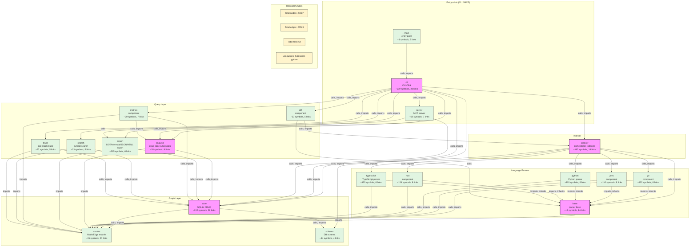

# Eizō (映像) — Codebase Knowledge Graph CLI

[](https://github.com/ninja-apps/eizo/actions)
[](https://www.python.org/)
[](LICENSE)

映像 — "imagem/reflexão". Reflete a estrutura do código como um grafo de conhecimento.

## Visão Geral

**Eizō** é uma CLI Python que parseia codebases com **Tree-sitter**, constrói um **knowledge graph** de código em **SQLite**, e expõe consultas via **CLI** e **servidor MCP** (Model Context Protocol) para agentes LLM.

### Para que serve?

- **Desenvolvedores**: entenda a arquitetura de qualquer repositório sem ler arquivo por arquivo
- **Agentes LLM**: dê contexto estrutural para Claude Code, Cline, Roo Code, Continue e outros via MCP
- **Onboarding**: novos membros do time exploram o grafo em vez de grep cego
- **Análise de impacto**: antes de mudar um símbolo, veja toda a cadeia de dependências

## Stack

| Camada | Tecnologia |
|--------|-----------|
| CLI | Python 3.10+ / Click / Rich |
| Parsing | Tree-sitter (Python + TypeScript/JavaScript + Go + Rust + Java + C# + PHP + Ruby) |
| Grafo | SQLite (WAL mode, FTS5) |
| MCP | `mcp` Python SDK |
| Testes | pytest + pytest-cov |
| Lint | Ruff + mypy |

## Requisitos

- **Python 3.10+**
- **Graphviz (opcional)**: necessário apenas para `eizo export svg` e
  `eizo export png` — é binário de sistema, não dependência Python:
  - Debian/Ubuntu: `apt install graphviz`
  - macOS: `brew install graphviz`
  - Windows: `choco install graphviz` (ou instalador do site oficial)

## Instalação

```bash
# Clone o repositório
git clone https://github.com/ninja-apps/eizo.git
cd eizo

# Instale com dependências de desenvolvimento
make install
# ou: pip install -e ".[dev]"
```

### Instalação no Windows

O Eizō suporta Windows nativamente (Python 3.10+). O `make` não existe por
padrão no Windows — use `py` (o launcher oficial do Python) diretamente:

```powershell
# Instale com dependências de desenvolvimento
py -m pip install -e ".[dev]"

# Ou apenas o pacote, sem dev deps
py -m pip install eizo
```

Notas:

- Requer **Python 3.10 ou superior** no Windows (instale pelo
  [python.org](https://www.python.org/downloads/) ou Microsoft Store).
- Se `py` não estiver disponível, use `python -m pip ...` (desde que o
  Python esteja no PATH).
- Os parsers Tree-sitter (Python, TypeScript, Go, Rust, Java, C#, PHP, Ruby)
  têm wheels para Windows — não é necessário compilar nada.
- O CI roda a suíte completa (lint + typecheck + testes + coverage) em
  `windows-latest` a cada push/PR.

## Uso

### Indexar um repositório

```bash
# Indexa o diretório atual (incremental — pula arquivos inalterados)
eizo init

# Indexa um diretório específico
eizo init /caminho/do/projeto

# Ou via --repo/-C
eizo init --repo /caminho/do/projeto

# Lista arquivos que seriam indexados sem persistir
eizo init --dry-run
eizo init --dry-run --output-format json

# Força reindexação de todos os arquivos
eizo init --force

# Reconstrói o grafo do zero (limpa DB + reindexa tudo)
eizo init --rebuild
```

A indexação é **incremental**: arquivos cujo conteúdo (hash SHA-256) não mudou
desde a última indexação são pulados automaticamente. Use `--force` ou `--rebuild`
para forçar reindexação completa.

`eizo init` também sincroniza com o disco: arquivos removidos ou renomeados
desde a última indexação têm seus símbolos removidos do grafo automaticamente
— sem flag, sem precisar de `--rebuild`.

Se existir `.gitignore` e/ou `.eizoignore` na raiz do repositório indexado,
seus padrões são respeitados (mesma sintaxe do git). `.eizoignore` serve para
excluir da indexação algo que o git rastreia mas você não quer no grafo — por
exemplo, um `vendor/` versionado de propósito.

### Observar mudanças continuamente

```bash
# Reindexa a cada 2s (padrão) enquanto houver mudanças
eizo watch

# Intervalo customizado
eizo watch --interval 1
```

Faz polling, não reage a eventos do sistema de arquivos — mas a indexação
incremental já é rápida o bastante para isso não importar na prática. Ctrl+C
para parar.

### Comparar contra um ref git (ou entre dois refs)

```bash
# O que mudou (em símbolos) no working tree em relação a main
eizo diff main

# Contra um branch remoto
eizo diff origin/main

# Entre dois refs (branch, tag ou commit)
eizo diff main..origin/main
```

Não precisa de `eizo init` — reparseia direto do disco e via `git show`, sem
tocar no grafo indexado. Mostra apenas mudanças que afetam a *superfície* de
símbolos (funções/classes/métodos adicionados ou removidos); uma edição que
só muda o corpo de uma função não aparece.

### Buscar símbolos

```bash
# Busca por nome
eizo search "get_user"

# Filtra por tipo e linguagem
eizo search "User" --kind class --language python

# Limita resultados
eizo search "helper" --limit 5

# Busca full-text (FTS5) em docstrings e trechos de código
eizo search "processa pagamento" --full-text
```

### Traçar call graph

```bash
# Quem chama e quem é chamado
eizo trace "processar_pagamento"

# Apenas quem chama
eizo trace "calcular_total" --direction incoming

# Apenas quem é chamado
eizo trace "main" --direction outgoing

# Profundidade maior
eizo trace "iniciar" --depth 5
```

### Por que dois símbolos estão acoplados

```bash
# Caminho mais curto de dependência entre A e B
eizo why main helper

# Aumenta o limite de saltos da busca
eizo why UserService Database --max-depth 15
```

É o inverso de `trace`: em vez de listar tudo que um símbolo chama, mostra
especificamente *como* A chega em B (seguindo calls/inherits). Se só existir
caminho na direção contrária (B depende de A), o comando reporta isso
explicitamente em vez de forçar o resultado errado.

### Analisar impacto

```bash
# Cadeia de dependências de um símbolo
eizo impact "DatabaseConnection"

# Profundidade maior
eizo impact "UserModel" --depth 5
```

### Detectar código morto

```bash
# Lista símbolos definidos sem nenhum caller/import
eizo dead

# Exclui entrypoints customizados
eizo dead --entrypoint my_handler --entrypoint my_cli
```

Símbolos como `main`, `run`, `serve`, `cli`, `app`, `create_app`, `setup`,
`teardown`, `handle` são considerados entrypoints por padrão e excluídos
da análise.

### Ciclos de import

```bash
eizo cycles
```

Detecta dependência circular entre arquivos (ex: `a.py` importa `b.py` que
importa `a.py`). Resolve cada import para um arquivo candidato pela mesma
heurística de nome usada em `trace`/`impact` — não é resolução real de
import/módulo.

### Hotspots (símbolos críticos)

```bash
# Top 20 símbolos mais referenciados
eizo hotspots

# Top 50 com mínimo de 5 referências
eizo hotspots --limit 50 --min-refs 5
```

Símbolos com muitas referências são pontos críticos — mudanças neles têm
alto impacto na base de código.

### Métricas por símbolo

```bash
eizo metrics minha_funcao
```

Mostra fan-in (quantos símbolos distintos referenciam este), fan-out (quantos
este referencia) e LOC (linhas da definição). Usa dados já existentes no
grafo — sem análise nova de AST, então não inclui complexidade ciclomática.

### Exportar grafo

```bash
# Exporta para Graphviz DOT
eizo export dot -o graph.dot
dot -Tpng graph.dot -o graph.png  # renderiza com Graphviz

# Exporta para Mermaid (renderiza em GitHub, GitLab, Notion)
eizo export mermaid --kind class --edge-kind inherits

# Exporta para JSON
eizo export json --language python --limit 50 -o graph.json

# Diagrama de classes Mermaid
eizo export mermaid --diagram-type classDiagram

# Renderiza direto para SVG ou PNG (requer graphviz instalado)
eizo export svg -o graph.svg
eizo export png -o graph.png
```

Filtros disponíveis: `--kind`, `--language`, `--limit`, `--edge-kind` (múltiplo).

> **SVG/PNG** usam o binário `dot` do graphviz (dependência opcional de
> sistema — ver [Requisitos](#requisitos)). Sem `-o`, o arquivo é escrito
> como `graph.svg`/`graph.png` no diretório atual.

### Visualizar em 3D

```bash
# Gera um HTML autocontido (offline, sem dependência de rede) com o grafo
# navegável em 3D: rotação/zoom, destaque de vizinhos ao passar o mouse,
# painel de detalhes ao clicar em um nó, e busca por nome
eizo export html -o graph.html

# abra graph.html no navegador

# Os mesmos filtros de --kind/--language/--limit/--edge-kind se aplicam,
# útil para focar em uma parte do grafo (ex: apenas hierarquia de classes)
eizo export html --kind class --edge-kind inherits -o classes.html
```

### Visão arquitetural

```bash
eizo arch
```

Exemplo de saída:

```
Linguagens
┏━━━━━━━━━━━━┳━━━━━━┳━━━━━━━━━━┓
┃ Linguagem  ┃  Nós ┃ Arquivos ┃
┡━━━━━━━━━━━━╇━━━━━━╇━━━━━━━━━━┩
│ python     │  156 │       12 │
│ typescript │   89 │        8 │
└────────────┴──────┴──────────┘

Símbolos por Tipo
┏━━━━━━━━━━┳━━━━━━━━━━┓
┃ Tipo     ┃ Qtde     ┃
┡━━━━━━━━━━╇━━━━━━━━━━┩
│ function │      120 │
│ class    │       35 │
│ import   │       60 │
│ method   │       30 │
└──────────┴──────────┘
```

### Diagrama de arquitetura em Mermaid

Gera um diagrama de alto nível em camadas, renderizável no GitHub/GitLab/Notion:

```bash
eizo architecture -o arch.mmd
```

Exemplo do diagrama gerado para o próprio Eizō:


```mermaid
graph TD
  classDef layerClass fill:#f9f,stroke:#333,stroke-width:2px;
  classDef componentClass fill:#e1f5e1,stroke:#333,stroke-width:1px;
  classDef statsClass fill:#fff4cc,stroke:#333,stroke-width:1px;
  subgraph entrypoints["Entrypoints (CLI / MCP)"]
    comp_cli_py["cli<br/>CLI Click<br/>~559 symbols, 28 links"]
    class comp_cli_py componentClass;
    comp_mcp_server_py["server<br/>MCP server<br/>~59 symbols, 7 links"]
    class comp_mcp_server_py componentClass;
    comp___main___py["__main__<br/>entry point<br/>~3 symbols, 2 links"]
    class comp___main___py componentClass;
  end
  class comp_cli_py layerClass;
  subgraph queries["Query Layer"]
    comp_queries_analysis_py["analysis<br/>dead code & hotspots<br/>~28 symbols, 9 links"]
    class comp_queries_analysis_py componentClass;
    comp_queries_metrics_py["metrics<br/>component<br/>~20 symbols, 7 links"]
    class comp_queries_metrics_py componentClass;
    comp_queries_export_py["export<br/>DOT/Mermaid/JSON/HTML export<br/>~215 symbols, 6 links"]
    class comp_queries_export_py componentClass;
    comp_queries_diff_py["diff<br/>component<br/>~37 symbols, 5 links"]
    class comp_queries_diff_py componentClass;
    comp_queries_trace_py["trace<br/>call graph trace<br/>~27 symbols, 5 links"]
    class comp_queries_trace_py componentClass;
    comp_queries_search_py["search<br/>symbol search<br/>~23 symbols, 5 links"]
    class comp_queries_search_py componentClass;
  end
  class comp_queries_analysis_py layerClass;
  subgraph graph["Graph Layer"]
    comp_graph_store_py["store<br/>SQLite CRUD<br/>~202 symbols, 26 links"]
    class comp_graph_store_py componentClass;
    comp_graph_models_py["models<br/>Node/Edge models<br/>~15 symbols, 20 links"]
    class comp_graph_models_py componentClass;
    comp_graph_schema_py["schema<br/>DB schema<br/>~44 symbols, 4 links"]
    class comp_graph_schema_py componentClass;
  end
  class comp_graph_store_py layerClass;
  subgraph parsers["Language Parsers"]
    comp_parser_base_py["base<br/>parser base<br/>~12 symbols, 14 links"]
    class comp_parser_base_py componentClass;
    comp_parser_rust_py["rust<br/>component<br/>~124 symbols, 6 links"]
    class comp_parser_rust_py componentClass;
    comp_parser_go_py["go<br/>component<br/>~122 symbols, 6 links"]
    class comp_parser_go_py componentClass;
    comp_parser_typescript_py["typescript<br/>TypeScript parser<br/>~120 symbols, 6 links"]
    class comp_parser_typescript_py componentClass;
    comp_parser_python_py["python<br/>Python parser<br/>~110 symbols, 6 links"]
    class comp_parser_python_py componentClass;
    comp_parser_java_py["java<br/>component<br/>~110 symbols, 6 links"]
    class comp_parser_java_py componentClass;
  end
  class comp_parser_base_py layerClass;
  subgraph indexer["Indexer"]
    comp_indexer_py["indexer<br/>orchestrates indexing<br/>~167 symbols, 18 links"]
    class comp_indexer_py componentClass;
  end
  class comp_indexer_py layerClass;
  comp___main___py -->|"calls, imports"| comp_cli_py
  comp_cli_py -->|"calls, imports"| comp_graph_schema_py
  comp_cli_py -->|"calls, imports"| comp_graph_store_py
  comp_cli_py -->|"calls, imports"| comp_indexer_py
  comp_cli_py -->|"calls, imports"| comp_mcp_server_py
  comp_cli_py -->|"calls, imports"| comp_queries_analysis_py
  comp_cli_py -->|"calls, imports"| comp_queries_diff_py
  comp_cli_py -->|"calls, imports"| comp_queries_export_py
  comp_cli_py -->|"calls, imports"| comp_queries_metrics_py
  comp_cli_py -->|"calls, imports"| comp_queries_search_py
  comp_cli_py -->|"calls, imports"| comp_queries_trace_py
  comp_graph_store_py -->|"calls, imports"| comp_graph_models_py
  comp_graph_store_py -->|"calls, imports"| comp_graph_schema_py
  comp_indexer_py -->|"calls, imports"| comp_graph_store_py
  comp_indexer_py -->|"calls, imports"| comp_parser_base_py
  comp_indexer_py -->|"calls, imports"| comp_parser_go_py
  comp_indexer_py -->|"calls, imports"| comp_parser_java_py
  comp_indexer_py -->|"calls, imports"| comp_parser_python_py
  comp_indexer_py -->|"calls, imports"| comp_parser_rust_py
  comp_indexer_py -->|"calls, imports"| comp_parser_typescript_py
  comp_mcp_server_py -->|"calls, imports"| comp_graph_store_py
  comp_mcp_server_py -->|"calls, imports"| comp_queries_analysis_py
  comp_mcp_server_py -->|"calls"| comp_queries_export_py
  comp_parser_base_py -->|"imports"| comp_graph_models_py
  comp_parser_go_py -->|"calls, imports"| comp_graph_models_py
  comp_parser_go_py -->|"imports, inherits"| comp_parser_base_py
  comp_parser_java_py -->|"calls, imports"| comp_graph_models_py
  comp_parser_java_py -->|"imports, inherits"| comp_parser_base_py
  comp_parser_python_py -->|"calls, imports"| comp_graph_models_py
  comp_parser_python_py -->|"imports, inherits"| comp_parser_base_py
  comp_parser_rust_py -->|"calls, imports"| comp_graph_models_py
  comp_parser_rust_py -->|"imports, inherits"| comp_parser_base_py
  comp_parser_typescript_py -->|"calls, imports"| comp_graph_models_py
  comp_parser_typescript_py -->|"imports, inherits"| comp_parser_base_py
  comp_queries_analysis_py -->|"imports"| comp_graph_models_py
  comp_queries_analysis_py -->|"calls, imports"| comp_graph_store_py
  comp_queries_diff_py -->|"calls, imports"| comp_indexer_py
  comp_queries_diff_py -->|"calls"| comp_parser_base_py
  comp_queries_export_py -->|"imports"| comp_graph_models_py
  comp_queries_export_py -->|"calls, imports"| comp_graph_store_py
  comp_queries_metrics_py -->|"imports"| comp_graph_models_py
  comp_queries_metrics_py -->|"calls, imports"| comp_graph_store_py
  comp_queries_metrics_py -->|"calls, imports"| comp_queries_analysis_py
  comp_queries_search_py -->|"imports"| comp_graph_models_py
  comp_queries_search_py -->|"calls, imports"| comp_graph_store_py
  comp_queries_trace_py -->|"imports"| comp_graph_models_py
  comp_queries_trace_py -->|"calls, imports"| comp_graph_store_py

  subgraph Stats["Repository Stats"]
    total_nodes["Total nodes: 27587"]
    total_edges["Total edges: 27523"]
    total_files["Total files: 64"]
    languages["Languages: typescript, python"]
  end
  class total_nodes,total_edges,total_files,languages statsClass;
```

### Servidor MCP

```bash
# Inicia servidor MCP com transporte SSE (HTTP) na porta 8765
eizo mcp

# Porta customizada
eizo mcp --port 9090

# Transporte stdio (padrão para agents locais como Claude Code)
eizo mcp --transport stdio

# Repositório específico
eizo mcp --repo /caminho/do/projeto
```

O servidor expõe 8 ferramentas MCP:

| Tool | Descrição |
|------|-----------|
| `search_symbols` | Busca símbolos por nome |
| `get_symbol_context` | Contexto completo de um símbolo |
| `trace_call_path` | Call graph de/para um símbolo |
| `analyze_impact` | Cadeia de dependências |
| `get_architecture` | Visão arquitetural do repositório |
| `get_architecture_mermaid` | Diagrama de arquitetura em Mermaid |
| `find_dead_code_symbols` | Detecta código morto |
| `get_hotspots` | Símbolos mais referenciados |

### Status

```bash
eizo status
```

## Comandos

| Comando | Descrição |
|---------|-----------|
| `eizo init [path]` | Indexa repositório no grafo (incremental — cria, atualiza e remove) |
| `eizo watch [path]` | Reindexa continuamente ao detectar mudanças (polling) |
| `eizo diff <ref>` | Compara símbolos do working tree contra um ref git |
| `eizo diff <ref1>..<ref2>` | Compara símbolos entre dois refs git |
| `eizo search <query>` | Busca símbolos |
| `eizo trace <symbol>` | Call graph |
| `eizo why <a> <b>` | Caminho de dependência entre dois símbolos |
| `eizo impact <symbol>` | Análise de impacto |
| `eizo arch` | Visão arquitetural |
| `eizo dead` | Detecta código morto (sem callers) |
| `eizo cycles` | Detecta ciclos de import entre arquivos |
| `eizo hotspots` | Símbolos mais referenciados |
| `eizo metrics <symbol>` | Fan-in, fan-out e LOC de um símbolo |
| `eizo export dot\|mermaid\|json\|html\|svg\|png` | Exporta grafo para visualização |
| `eizo architecture` | Gera diagrama de arquitetura em Mermaid |
| `eizo mcp` | Servidor MCP |
| `eizo status` | Estatísticas do grafo |

### Opções globais

| Opção | Descrição |
|---|---|
| `--output-format [table\|json]` | Formato de saída (padrão: `table`) |
| `--repo`, `-C` | Caminho do repositório |
| `--config` | Arquivo de configuração JSON alternativo |
| `--color` | Força cores na saída |
| `--no-color` | Desativa cores na saída |
| `-v`, `-vv` | Aumenta verbosidade (INFO / DEBUG) |
| `--quiet` | Silencia mensagens de log (apenas erros) |
| `--show-completion` | Mostra script de shell completion |
| `--install-completion` | Mostra script de shell completion |

Todos os comandos de consulta suportam `--output-format json` para piping em scripts e agents:

```bash
eizo --output-format json search "UserModel" | jq '.[0].file_path'
eizo --output-format json dead | jq 'length'
eizo --output-format json hotspots --min-refs 3 | jq '.[] | .node.name'
eizo --output-format json init /caminho/do/projeto
```

### Configuração via arquivo

Crie `{repo}/.eizo/config.json` para definir defaults por repositório:

```json
{
  "output_format": "json",
  "no_color": false,
  "limit": 20,
  "depth": 3,
  "min_refs": 3,
  "full_text": true
}
```

Prioridade de merge: **CLI args > env vars > config file > Click defaults**.

### Variáveis de ambiente

| Variável | Descrição |
|---|---|
| `EIZO_OUTPUT_FORMAT` | Default de `--output-format` |
| `EIZO_REPO` | Default de `--repo`/`-C` |
| `EIZO_CONFIG` | Caminho alternativo do config.json |
| `EIZO_NO_COLOR` | Desativa cores (`1`, `true`, `yes`, `on`) |
| `NO_COLOR` | Padrão global; também desativa cores |
| `EIZO_LIMIT` | Default de `--limit` |
| `EIZO_DEPTH` | Default de `--depth` |
| `EIZO_MIN_REFS` | Default de `--min-refs` |
| `EIZO_FULL_TEXT` | Default de `--full-text` |

## Desenvolvimento

```bash
make install      # instala com dev deps
make test         # roda pytest
make lint         # ruff check
make typecheck    # mypy
make check        # lint + typecheck + test
make coverage     # pytest com cobertura
```

## Estrutura do Projeto

```
eizo/
├── src/eizo/
│   ├── cli.py               # Entry point Click (16 comandos)
│   ├── __main__.py          # python -m eizo
│   ├── indexer.py           # Orquestrador de indexação incremental
│   ├── graph/
│   │   ├── models.py        # Dataclasses Node, Edge, GraphStats
│   │   ├── schema.py        # Schema SQLite v3 + migrações
│   │   └── store.py         # GraphStore CRUD, FTS5, file_index
│   ├── parser/
│   │   ├── base.py          # Parser base abstrato
│   │   ├── python.py        # Parser Python (Tree-sitter)
│   │   ├── typescript.py    # Parser TS/JS (Tree-sitter)
│   │   ├── go.py            # Parser Go (Tree-sitter)
│   │   ├── rust.py          # Parser Rust (Tree-sitter)
│   │   ├── java.py          # Parser Java (Tree-sitter)
│   │   ├── csharp.py        # Parser C# (Tree-sitter)
│   │   ├── php.py           # Parser PHP (Tree-sitter)
│   │   └── ruby.py          # Parser Ruby (Tree-sitter)
│   ├── queries/
│   │   ├── search.py        # Busca textual e FTS5
│   │   ├── trace.py         # Call graph
│   │   ├── why.py           # Caminho de dependência entre símbolos
│   │   ├── impact.py        # Análise de impacto
│   │   ├── analysis.py      # Código morto e hotspots
│   │   ├── cycles.py        # Ciclos de import (Tarjan SCC)
│   │   ├── metrics.py       # Fan-in, fan-out e LOC
│   │   ├── diff.py          # Diff de símbolos contra ref git (1 ou 2 refs)
│   │   └── export.py        # Export DOT/Mermaid/JSON/HTML/SVG/PNG + arquitetura
│   ├── static/              # Assets do HTML export
│   │   └── vendor/          # vis-network, etc.
│   └── mcp/
│       └── server.py        # Servidor MCP (8 tools)
├── tests/
│   ├── conftest.py
│   ├── test_analysis.py
│   ├── test_cli.py
│   ├── test_cli_cycles.py
│   ├── test_cli_diff.py
│   ├── test_cli_metrics.py
│   ├── test_cli_why.py
│   ├── test_coverage_gaps.py
│   ├── test_export.py
│   ├── test_export_html.py
│   ├── test_incremental.py
│   ├── test_indexer.py
│   ├── test_indexer_extended.py
│   ├── test_main.py
│   ├── test_mcp_server.py
│   ├── test_models.py
│   ├── test_parser_base.py
│   ├── test_parser_go.py
│   ├── test_parser_go_extended.py
│   ├── test_parser_java.py
│   ├── test_parser_java_extended.py
│   ├── test_parser_csharp.py
│   ├── test_parser_csharp_extended.py
│   ├── test_parser_php.py
│   ├── test_parser_php_extended.py
│   ├── test_parser_ruby.py
│   ├── test_parser_ruby_extended.py
│   ├── test_parser_python.py
│   ├── test_parser_python_extended.py
│   ├── test_parser_rust.py
│   ├── test_parser_rust_extended.py
│   ├── test_parser_typescript.py
│   ├── test_parser_typescript_extended.py
│   ├── test_queries_cycles.py
│   ├── test_queries_diff.py
│   ├── test_queries_extended.py
│   ├── test_queries_impact.py
│   ├── test_queries_metrics.py
│   ├── test_queries_search.py
│   ├── test_queries_trace.py
│   ├── test_queries_why.py
│   ├── test_schema.py
│   ├── test_store.py
│   └── test_store_extended.py
├── pyproject.toml
├── Makefile
├── AGENTS.md
└── README.md
```

## Roadmap

- **Fase 1 (Sprint 8) — Robustez**: captura de chamadas dentro de macros Rust, fuzzing dos parsers, benchmark com 10k+ arquivos
- **Fase 2 (Sprint 9) — API pública estável**: congelamento da API, docs de API, diff entre branches
- **Fase 3 (Sprint 10) — Mais linguagens**: parsers C#/PHP/Ruby, suporte nativo a Windows
- **Fase 4 (Sprint 11) — Release 1.0.0**: export SVG/PNG, changelog consolidado, tag final ✅

## API pública

A partir do Sprint 9, o pacote `eizo` tem uma **superfície pública estável**
(contrato de compatibilidade até 1.0.0 e depois). O que é público, o que é
interno e a política de deprecation estão documentados em
[docs/api.md](docs/api.md):

- **API estável**: `eizo.graph.GraphStore`/`Node`/`Edge`/`GraphStats`/
  `DEFINITION_KINDS`, `eizo.index_repository`, as funções de
  `eizo.queries.*` (search/trace/why/impact/analysis/cycles/metrics/diff/
  export) e `eizo.mcp.server.create_server`/`serve_mcp`.
- **CLI estável por contrato de CLI**: comandos/opções são estáveis; o
  módulo `eizo.cli` não é API Python.
- **Internos** (mudam sem aviso): `eizo.graph.schema`, `eizo.graph.store`
  (use o re-export), `eizo.parser.*`, `eizo.indexer` (use o re-export),
  `eizo.static`, `eizo.__main__` e funções com prefixo `_`.

**Deprecation policy**: mudanças que quebram a API estável seguem um ciclo
de 2 versões — `DeprecationWarning` + registro no CHANGELOG na versão N,
remoção na versão N+1. Exceções: segurança, bugs de comportamento indefinido
e símbolos internos.

## Licença

MIT
